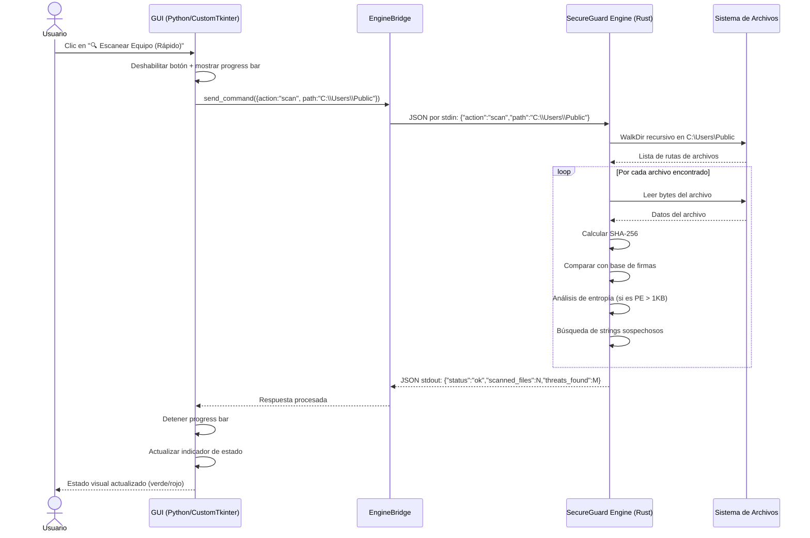
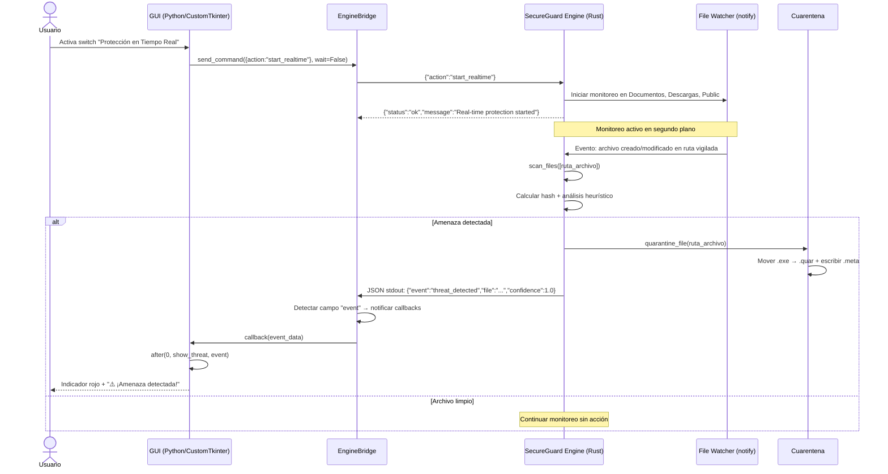
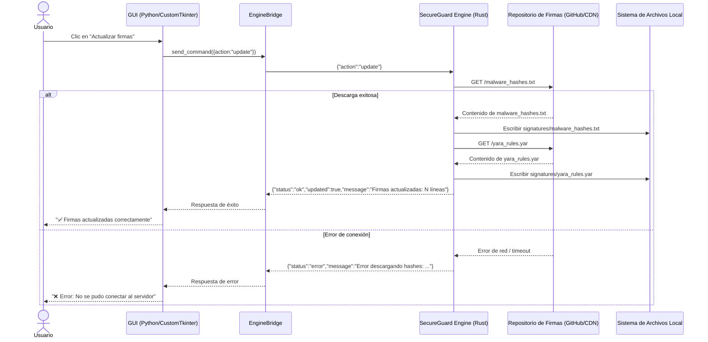
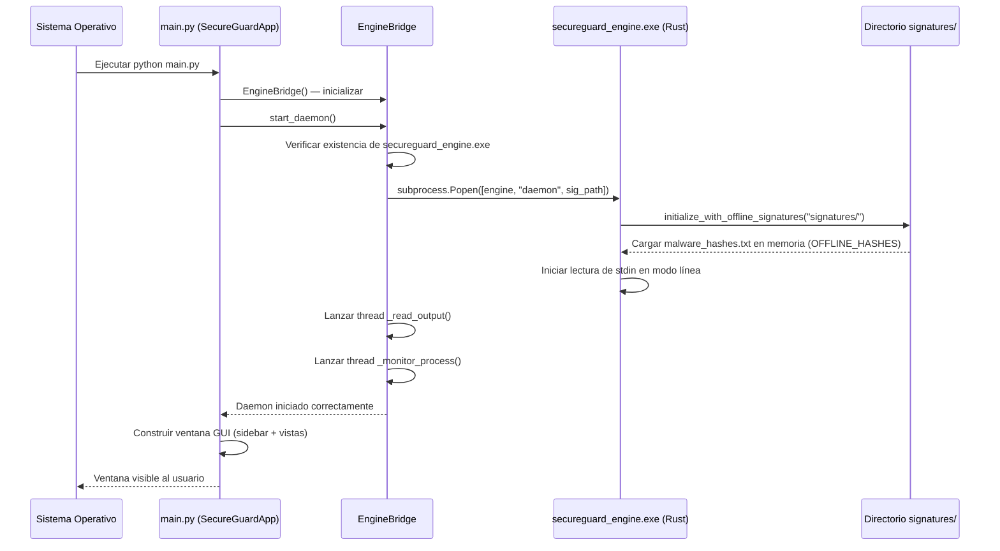

<center>


**UNIVERSIDAD PRIVADA DE TACNA**

**FACULTAD DE INGENIERIA**

**Escuela Profesional de Ingeniería de Sistemas**

**Proyecto de Antivirus**

Curso: *Calidad y Pruebas de Software*

Docente: *Mag. Patrick Cuadros Quiroga*

Integrantes:

***LLica Mamani, Jimmy Mijair (2023076789)***

***Sierra Ruiz, Iker Alberto (2023077090)***

**Tacna – Perú**

***2026***

</center>

<div style="page-break-after: always; visibility: hidden"></div>

Sistema *SecureGuard Antivirus*

Informe de Especificación de Requerimientos

Versión *1.0*

| CONTROL DE VERSIONES | | | | |
|:---:|:---|:---|:---|:---|
| Versión | Hecha por | Revisada por | Aprobada por | Fecha | Motivo |
| 1.0 | Sierra Ruiz, Iker Alberto | LLica Mamani, Jimmy Mijair | LLica Mamani, Jimmy Mijair | 01/05/2026 | Versión Original |

<div style="page-break-after: always; visibility: hidden"></div>

# **ÍNDICE GENERAL**

[1. Introducción](#1-introducción)

[2. Historias de Usuario](#2-historias-de-usuario)

[3. Criterios de Aceptación (Gherkin)](#3-criterios-de-aceptación-gherkin)

[4. Escenarios de Prueba (Gherkin)](#4-escenarios-de-prueba-gherkin)

[5. Diagramas de Secuencia](#5-diagramas-de-secuencia)

[6. Requerimientos No Funcionales](#6-requerimientos-no-funcionales)

[7. Conclusiones](#7-conclusiones)

<div style="page-break-after: always; visibility: hidden"></div>

**<u>Informe de Especificación de Requerimientos</u>**

## 1. Introducción

### 1.1. Propósito

El presente documento especifica los requerimientos funcionales y no funcionales del sistema SecureGuard Antivirus. Los requerimientos se expresan como historias de usuario siguiendo el formato estándar ágil, con criterios de aceptación formalizados en lenguaje Gherkin (Given-When-Then) para facilitar la automatización de pruebas.

### 1.2. Alcance

Los requerimientos descritos en este documento cubren todos los módulos del sistema SecureGuard Antivirus: motor de escaneo (Rust), interfaz gráfica (Python/CustomTkinter), gestión de cuarentena, control de firewall, limpieza del sistema y actualización de firmas.

### 1.3. Definiciones

| Término | Definición |
|:--------|:-----------|
| **Motor / Engine** | Proceso Rust (`secureguard_engine`) que ejecuta las operaciones de seguridad |
| **EngineBridge** | Módulo Python que gestiona la comunicación IPC entre GUI y motor |
| **Firma** | Hash SHA-256 de un archivo de malware conocido |
| **Cuarentena** | Directorio aislado donde se mueven archivos detectados como amenazas |
| **Daemon** | Modo de operación persistente del motor, que acepta comandos JSON por stdin |
| **PE** | Portable Executable, formato de archivo ejecutable de Windows |

<div style="page-break-after: always; visibility: hidden"></div>

## 2. Historias de Usuario

### HU-01: Escaneo Manual del Sistema

**Como** usuario final de SecureGuard Antivirus,  
**Quiero** iniciar un escaneo manual de archivos en mi equipo desde el dashboard,  
**Para** detectar malware y amenazas en mis archivos antes de que puedan ejecutarse.

**Prioridad:** Alta | **Story Points:** 5 | **Issue:** #7

---

### HU-02: Protección en Tiempo Real

**Como** usuario final de SecureGuard Antivirus,  
**Quiero** activar la protección en tiempo real del sistema de archivos,  
**Para** que cualquier archivo nuevo o modificado sea analizado automáticamente sin intervención manual.

**Prioridad:** Alta | **Story Points:** 8 | **Issue:** #8

---

### HU-03: Gestión de Cuarentena

**Como** usuario final de SecureGuard Antivirus,  
**Quiero** ver, restaurar y eliminar los archivos que están en cuarentena,  
**Para** tener control sobre los archivos detectados como amenazas y recuperar falsos positivos.

**Prioridad:** Alta | **Story Points:** 5 | **Issue:** #9

---

### HU-04: Control del Firewall de Windows

**Como** usuario final de SecureGuard Antivirus,  
**Quiero** activar o desactivar el firewall de Windows desde la interfaz del antivirus,  
**Para** gestionar la protección de red de mi equipo desde un único panel de control.

**Prioridad:** Media | **Story Points:** 3 | **Issue:** #10

---

### HU-05: Limpieza de Archivos Temporales

**Como** usuario final de SecureGuard Antivirus,  
**Quiero** limpiar archivos temporales del sistema con un solo clic,  
**Para** liberar espacio en disco y eliminar posibles vectores de infección por archivos residuales.

**Prioridad:** Media | **Story Points:** 3 | **Issue:** #11

---

### HU-06: Actualización de Firmas de Malware

**Como** usuario final de SecureGuard Antivirus,  
**Quiero** actualizar la base de datos de firmas de malware desde el repositorio oficial,  
**Para** mantener la protección del sistema actualizada contra las amenazas más recientes.

**Prioridad:** Alta | **Story Points:** 5 | **Issue:** #12

---

### HU-07: Dashboard con Indicador de Estado

**Como** usuario final de SecureGuard Antivirus,  
**Quiero** ver en el dashboard el estado actual de protección de mi equipo,  
**Para** saber de un vistazo si mi sistema está protegido o si hay amenazas activas.

**Prioridad:** Alta | **Story Points:** 3 | **Issue:** #13

---

### HU-08: Notificación de Amenazas Detectadas

**Como** usuario final de SecureGuard Antivirus,  
**Quiero** recibir una alerta visual inmediata cuando se detecte una amenaza,  
**Para** estar informado en tiempo real sobre los intentos de infección en mi equipo.

**Prioridad:** Alta | **Story Points:** 3 | **Issue:** #8

---

### HU-09: Visualización de Información del Sistema

**Como** usuario final de SecureGuard Antivirus,  
**Quiero** ver información del hardware y del sistema (CPU, RAM, disco) en la sección de configuración,  
**Para** monitorear el impacto del antivirus en los recursos de mi equipo.

**Prioridad:** Baja | **Story Points:** 2 | **Issue:** #13

---

### HU-10: Anti-Ransomware

**Como** usuario final de SecureGuard Antivirus,  
**Quiero** activar la protección anti-ransomware,  
**Para** detectar comportamientos típicos de ransomware (cifrado masivo de archivos) antes de que se propaguen.

**Prioridad:** Alta | **Story Points:** 8 | **Issue:** #8

<div style="page-break-after: always; visibility: hidden"></div>

## 3. Criterios de Aceptación (Gherkin)

### HU-01: Escaneo Manual del Sistema

```gherkin
Feature: Escaneo manual del sistema de archivos
  Como usuario final
  Quiero iniciar un escaneo manual
  Para detectar malware en mis archivos

  Background:
    Given el motor SecureGuard Engine está en ejecución
    And la base de datos de firmas está cargada en memoria

  Scenario: Iniciar escaneo exitoso
    Given el usuario está en el Dashboard
    When el usuario hace clic en "🔍 Escanear Equipo (Rápido)"
    Then el botón cambia a estado deshabilitado con texto "Escaneando..."
    And se muestra la barra de progreso animada
    And el motor recibe el comando JSON {"action": "scan", "path": "C:\\Users\\Public"}

  Scenario: Escaneo completado sin amenazas
    Given el escaneo ha finalizado
    And no se encontraron archivos maliciosos
    Then el indicador de estado muestra "●" en verde (#2ECC71)
    And el texto de estado muestra "Escaneo completado - Sistema Protegido"
    And el botón vuelve a estado habilitado

  Scenario: Escaneo completado con amenaza detectada
    Given el escaneo ha finalizado
    And se encontró al menos una amenaza
    Then el indicador de estado muestra "●" en rojo (#E74C3C)
    And el texto muestra "⚠️ ¡Amenaza detectada! <nombre_archivo>"
    And el archivo amenazante es movido a cuarentena automáticamente
```

---

### HU-02: Protección en Tiempo Real

```gherkin
Feature: Protección en tiempo real del sistema de archivos
  Como usuario final
  Quiero activar la protección en tiempo real
  Para detectar amenazas automáticamente

  Scenario: Activar protección en tiempo real
    Given el usuario está en la vista "Módulos de Protección"
    And el switch "Protección en Tiempo Real" está desactivado
    When el usuario activa el switch
    Then la GUI envía {"action": "start_realtime"} al motor
    And el motor responde con {"status": "ok", "message": "Real-time protection started"}
    And el switch permanece en estado activado

  Scenario: Detección automática de archivo malicioso
    Given la protección en tiempo real está activa
    And la base de datos de firmas contiene el hash del archivo
    When se crea o modifica un archivo en Documentos, Descargas o Public
    Then el motor calcula el hash SHA-256 del archivo
    And compara el hash con la base de datos de firmas
    And si hay coincidencia, mueve el archivo a C:\ProgramData\SecureGuard\Quarantine
    And emite el evento JSON {"event": "threat_detected", "file": "...", "confidence": 1.0}
    And la GUI muestra alerta visual en el dashboard

  Scenario: Desactivar protección en tiempo real
    Given la protección en tiempo real está activa
    When el usuario desactiva el switch
    Then la GUI envía {"action": "stop_realtime"} al motor
    And el monitor de archivos detiene la vigilancia
```

---

### HU-03: Gestión de Cuarentena

```gherkin
Feature: Gestión de archivos en cuarentena
  Como usuario final
  Quiero gestionar los archivos en cuarentena
  Para controlar amenazas detectadas

  Scenario: Listar archivos en cuarentena
    Given el usuario navega a la vista "Archivos en Cuarentena"
    When la vista se inicializa
    Then el motor ejecuta el comando {"action": "list_quarantine"}
    And se muestra la lista de archivos con nombre original y tamaño
    And si la cuarentena está vacía se muestra el mensaje "No hay archivos en cuarentena"

  Scenario: Restaurar archivo de cuarentena
    Given hay al menos un archivo en cuarentena
    And el usuario ha seleccionado un archivo de la lista
    When el usuario hace clic en "Restaurar seleccionado"
    Then se envía {"action": "restore_quarantine", "file": "<nombre>.quar"}
    And el archivo se mueve de regreso a su ubicación original
    And la lista de cuarentena se actualiza automáticamente

  Scenario: Eliminar archivo de cuarentena
    Given hay al menos un archivo en cuarentena
    And el usuario ha seleccionado un archivo
    When el usuario hace clic en "Eliminar seleccionado"
    Then se envía {"action": "delete_quarantine", "file": "<nombre>.quar"}
    And el archivo y su metadato .meta son eliminados permanentemente
    And la lista de cuarentena se actualiza automáticamente
```

---

### HU-04: Control del Firewall

```gherkin
Feature: Control del firewall de Windows
  Como usuario final
  Quiero controlar el firewall desde la GUI
  Para gestionar la seguridad de red

  Scenario: Activar el firewall
    Given el usuario está en la vista "Firewall de Windows"
    And el switch "Activar Firewall" está desactivado
    When el usuario activa el switch
    Then la GUI muestra "Aplicando cambios..." en gris
    And envía {"action": "firewall_on"} al motor
    And el motor ejecuta: netsh advfirewall set allprofiles state on
    And el label de estado cambia a "Estado: ✅ Activo" en verde
    And los indicadores de perfiles (Dominio, Privado, Público) muestran "✔" en verde

  Scenario: Error al cambiar estado del firewall
    Given el motor no tiene permisos de administrador
    When el usuario intenta activar el firewall
    Then la GUI muestra el mensaje de error recibido del motor
    And el switch se revierte al estado anterior
    And el label de estado refleja el estado real del firewall
```

---

### HU-06: Actualización de Firmas

```gherkin
Feature: Actualización de base de datos de firmas de malware
  Como usuario final
  Quiero actualizar las firmas de malware
  Para tener protección contra amenazas recientes

  Scenario: Actualización exitosa de firmas
    Given el usuario está en la vista "Actualizaciones"
    And hay conexión a internet disponible
    When el usuario hace clic en "Actualizar firmas"
    Then el motor descarga malware_hashes.txt desde el repositorio de firmas
    And descarga yara_rules.yar desde el repositorio de firmas
    And guarda los archivos en el directorio signatures/
    And la respuesta incluye el número de hashes actualizados
    And se muestra confirmación: "Firmas actualizadas correctamente"

  Scenario: Fallo de actualización por falta de conexión
    Given no hay conexión a internet
    When el usuario intenta actualizar firmas
    Then el motor retorna un error de conexión
    And la GUI muestra "Error: No se pudo conectar al servidor de firmas"
    And las firmas existentes se mantienen sin cambios
```

<div style="page-break-after: always; visibility: hidden"></div>

## 4. Escenarios de Prueba (Gherkin)

### Prueba PT-01: Detección de malware conocido por hash

```gherkin
Scenario: Detectar archivo malicioso por hash SHA-256
  Given el motor tiene cargado un hash SHA-256 en la base de firmas:
    | hash                                                             |
    | e3b0c44298fc1c149afbf4c8996fb92427ae41e4649b934ca495991b7852b855 |
  And existe el archivo "test_malware.exe" cuyo SHA-256 coincide con el hash anterior
  When el motor escanea el archivo "test_malware.exe"
  Then el resultado incluye la amenaza con tipo "Malware conocido (hash)"
  And la confianza (confidence) es 1.0
  And el archivo es movido a la cuarentena
```

### Prueba PT-02: Detección heurística por entropía

```gherkin
Scenario: Detectar ejecutable sospechoso por alta entropía
  Given existe un archivo PE (MZ header) de más de 1024 bytes
  And la entropía del archivo es mayor a 7.5 bits/byte (indicativo de cifrado/empaquetado)
  When el motor escanea el archivo
  Then el resultado incluye la amenaza con tipo "Sospechoso (alta entropía + PE)"
  And la confianza es 0.5
```

### Prueba PT-03: Detección por strings sospechosos

```gherkin
Scenario: Detectar archivo con múltiples strings maliciosos
  Given existe un archivo de texto con el siguiente contenido:
    """
    CreateRemoteThread
    VirtualAllocEx
    WriteProcessMemory
    ransom
    """
  When el motor escanea los primeros 4096 bytes del archivo
  Then se identifican al menos 3 strings sospechosos de la lista de indicadores
  And el resultado incluye la amenaza con tipo "Sospechoso (strings: ...)"
  And la confianza es 0.6
```

### Prueba PT-04: Ruta inexistente en escaneo

```gherkin
Scenario: Manejar ruta inexistente en escaneo de directorio
  Given el directorio "C:\\RutaQueNoExiste" no existe en el sistema
  When el motor recibe el comando {"action": "scan", "path": "C:\\RutaQueNoExiste"}
  Then el motor retorna {"status": "error", "message": "La ruta no existe"}
  And no se producen excepciones no manejadas
```

### Prueba PT-05: Limpieza de archivos temporales

```gherkin
Scenario: Limpiar archivos temporales del sistema
  Given existen archivos en C:\Windows\Temp
  When el motor ejecuta el comando {"action": "clean"}
  Then el motor elimina todos los archivos accesibles en los directorios temporales
  And retorna {"status": "ok", "cleaned": N, "message": "N archivos/carpetas temporales eliminados"}
  And N es mayor o igual a 0
```

### Prueba PT-06: Restaurar archivo de cuarentena inexistente

```gherkin
Scenario: Intentar restaurar un archivo que no existe en cuarentena
  Given la cuarentena no contiene el archivo "noexiste.quar"
  When se envía {"action": "restore_quarantine", "file": "noexiste.quar"}
  Then el motor retorna {"status": "error", "message": "Archivo de cuarentena no encontrado"}
  And el sistema permanece estable sin excepciones
```

<div style="page-break-after: always; visibility: hidden"></div>

## 5. Diagramas de Secuencia

### 5.1. Secuencia: Escaneo Manual desde Dashboard



### 5.2. Secuencia: Detección en Tiempo Real



### 5.3. Secuencia: Actualización de Firmas



### 5.4. Secuencia: Inicio del Sistema (Daemon)



<div style="page-break-after: always; visibility: hidden"></div>

## 6. Requerimientos No Funcionales

### 6.1. Rendimiento

| ID | Requerimiento | Métrica | Criterio de Aceptación |
|:---|:--------------|:--------|:-----------------------|
| RNF-01 | Tiempo de respuesta al escaneo | Velocidad de escaneo | Mínimo 100 archivos/segundo en SSD |
| RNF-02 | Uso de CPU en estado idle | Monitoreo activo sin escaneo | ≤ 2% de CPU promedio |
| RNF-03 | Uso de RAM del motor | Proceso secureguard_engine.exe | ≤ 50 MB en estado idle |
| RNF-04 | Tiempo de inicio del daemon | Desde lanzamiento hasta listo | ≤ 3 segundos |

### 6.2. Confiabilidad

| ID | Requerimiento | Descripción |
|:---|:--------------|:------------|
| RNF-05 | Tasa de falsos negativos | El motor no debe dejar pasar más del 5% de amenazas conocidas |
| RNF-06 | Tasa de falsos positivos | La tasa de archivos legítimos marcados como amenaza debe ser ≤ 1% |
| RNF-07 | Recuperación ante fallos | Si el motor termina inesperadamente, la GUI debe detectarlo y notificar al usuario |

### 6.3. Seguridad

| ID | Requerimiento | Descripción |
|:---|:--------------|:------------|
| RNF-08 | Integridad de la cuarentena | Los archivos en cuarentena no deben poder ejecutarse |
| RNF-09 | Comunicación IPC | El canal stdin/stdout entre GUI y motor no debe ser accesible por otros procesos |
| RNF-10 | Sin telemetría no autorizada | El sistema no debe enviar datos del usuario a servidores externos sin consentimiento |

### 6.4. Mantenibilidad

| ID | Requerimiento | Descripción |
|:---|:--------------|:------------|
| RNF-11 | Cobertura de pruebas | ≥ 80% de cobertura de código en módulos críticos (scanner, quarantine) |
| RNF-12 | Arquitectura modular | Cada módulo del motor Rust debe ser reemplazable sin afectar los demás |
| RNF-13 | Documentación del código | Todas las funciones públicas deben tener documentación (rustdoc / docstring) |

<div style="page-break-after: always; visibility: hidden"></div>

## 7. Conclusiones

1. **Historias de usuario completas:** Las 10 historias de usuario cubren todos los módulos funcionales de SecureGuard Antivirus, desde la detección de amenazas hasta la gestión del firewall y la actualización de firmas.

2. **Criterios de aceptación ejecutables:** La formalización en Gherkin de los criterios de aceptación permite su traducción directa a pruebas automatizadas con frameworks como `pytest-bdd` o `behave`, facilitando la verificación continua.

3. **Diagramas de secuencia:** Los cuatro diagramas de secuencia documentan los flujos más críticos del sistema, revelando las responsabilidades de cada componente y los protocolos de comunicación entre la GUI Python y el motor Rust.

4. **Requerimientos no funcionales medibles:** Los RNF están definidos con métricas concretas y criterios de aceptación cuantificables, permitiendo su verificación objetiva durante las fases de prueba.

5. **Trazabilidad completa:** Cada historia de usuario está vinculada a un Issue de GitHub, garantizando la trazabilidad desde el requerimiento hasta la implementación y las pruebas.

---
