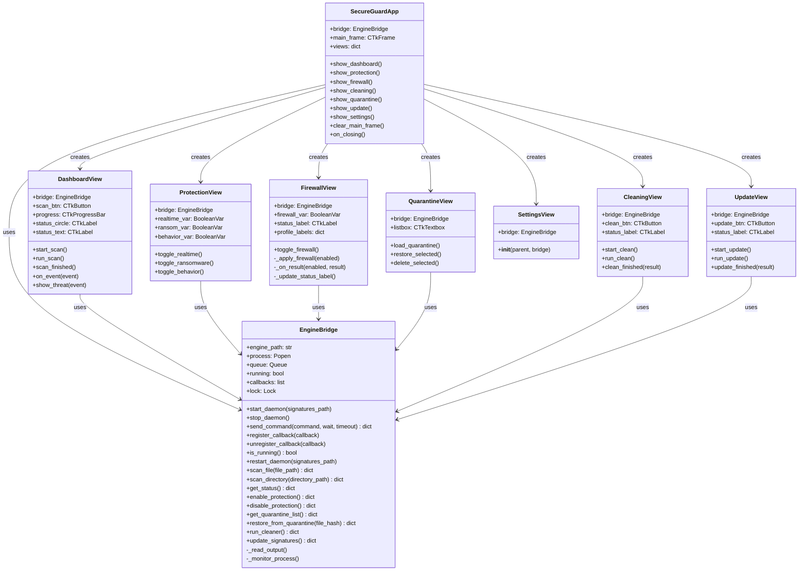
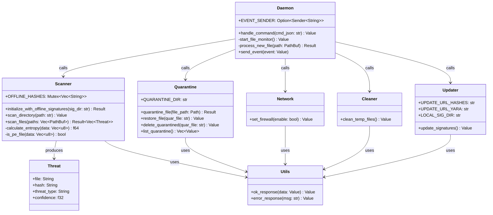
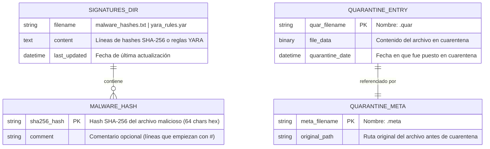
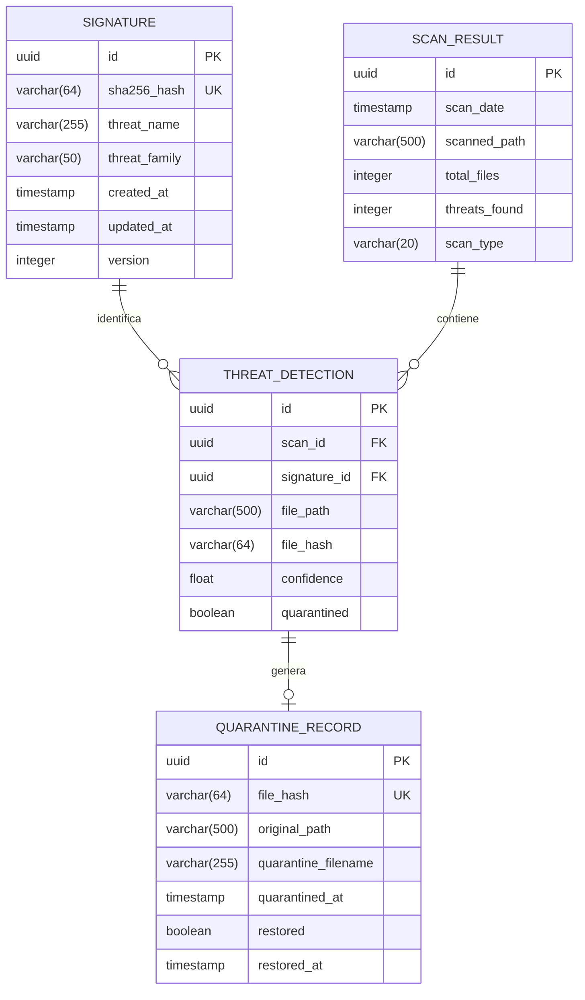
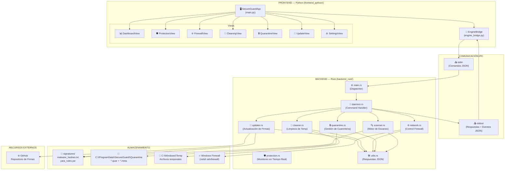
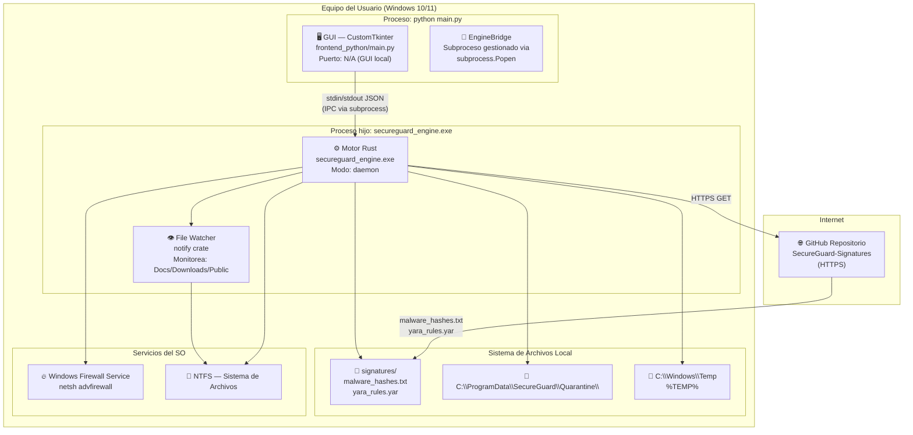

<center>


**UNIVERSIDAD PRIVADA DE TACNA**

**FACULTAD DE INGENIERIA**

**Escuela Profesional de Ingeniería de Sistemas**

**Proyecto de Antivirus**

Curso: *Calidad y Pruebas de Software*

Docente: *Mag. Patrick Cuadros Quiroga*

Integrantes:

***LLica Mamani, Jimmy Mijair (2023076789)***

***Sierra Ruiz, Iker Alberto (2023077090)***

**Tacna – Perú**

***2026***

</center>

<div style="page-break-after: always; visibility: hidden"></div>

Sistema *SecureGuard Antivirus*

Informe de Arquitectura de Software

Versión *1.0*

| CONTROL DE VERSIONES | | | | |
|:---:|:---|:---|:---|:---|
| Versión | Hecha por | Revisada por | Aprobada por | Fecha | Motivo |
| 1.0 | LLica Mamani, Jimmy Mijair | Sierra Ruiz, Iker Alberto | LLica Mamani, Jimmy Mijair | 01/05/2026 | Versión Original |

<div style="page-break-after: always; visibility: hidden"></div>

# **ÍNDICE GENERAL**

[1. Introducción](#1-introducción)

[2. Descripción de la Arquitectura](#2-descripción-de-la-arquitectura)

[3. Diagrama de Clases](#3-diagrama-de-clases)

[4. Diagrama de Base de Datos](#4-diagrama-de-base-de-datos)

[5. Diagrama de Componentes](#5-diagrama-de-componentes)

[6. Diagrama de Despliegue](#6-diagrama-de-despliegue)

[7. Infraestructura del Sistema](#7-infraestructura-del-sistema)

[8. Decisiones de Diseño Arquitectónico](#8-decisiones-de-diseño-arquitectónico)

[9. Conclusiones](#9-conclusiones)

<div style="page-break-after: always; visibility: hidden"></div>

**<u>Informe de Arquitectura de Software</u>**

## 1. Introducción

### 1.1. Propósito

El presente documento describe la arquitectura de software del sistema SecureGuard Antivirus, especificando la estructura de componentes, los diagramas de clases, la base de datos, el despliegue físico y las decisiones de diseño que guiaron la implementación.

### 1.2. Alcance

La arquitectura documentada cubre el sistema completo: el motor de seguridad (backend Rust), la interfaz gráfica (frontend Python/CustomTkinter) y el mecanismo de comunicación interproceso entre ambos componentes.

### 1.3. Definiciones Arquitectónicas

| Término | Definición |
|:--------|:-----------|
| **IPC** | Inter-Process Communication. Comunicación entre el proceso GUI y el proceso motor mediante stdin/stdout |
| **Daemon mode** | Modo de operación del motor donde permanece activo leyendo comandos en bucle |
| **EngineBridge** | Capa de abstracción en Python que encapsula toda la comunicación IPC |
| **OFFLINE_HASHES** | Variable global estática en Rust que almacena los hashes de firmas cargados al inicio |

<div style="page-break-after: always; visibility: hidden"></div>

## 2. Descripción de la Arquitectura

### 2.1. Estilo Arquitectónico

SecureGuard Antivirus implementa una arquitectura **cliente-servidor de proceso** con separación en **capas**:

```
┌─────────────────────────────────────────────────────────┐
│                    CAPA DE PRESENTACIÓN                  │
│        GUI Python (CustomTkinter) — frontend_python/    │
│   Dashboard │ Protección │ Firewall │ Cuarentena │ ...   │
├─────────────────────────────────────────────────────────┤
│                   CAPA DE INTEGRACIÓN                    │
│         EngineBridge — engine_bridge.py                 │
│   (JSON sobre stdin/stdout — comunicación IPC)          │
├─────────────────────────────────────────────────────────┤
│                   CAPA DE LÓGICA DE NEGOCIO              │
│       Motor Rust (secureguard_engine) — backend_rust/   │
│   Scanner │ Quarantine │ Network │ Cleaner │ Updater     │
├─────────────────────────────────────────────────────────┤
│                   CAPA DE DATOS / SISTEMA               │
│   Sistema de Archivos │ signatures/ │ Cuarentena (FS)   │
└─────────────────────────────────────────────────────────┘
```

### 2.2. Patrón de Comunicación

La comunicación entre la GUI y el motor se realiza mediante **mensajes JSON** a través de las tuberías estándar del proceso hijo:

- **GUI → Motor:** Comandos JSON escritos en `stdin` del proceso motor
- **Motor → GUI:** Respuestas y eventos JSON escritos en `stdout`
- **Formato comando:** `{"action": "<comando>", ...parámetros...}`
- **Formato respuesta:** `{"status": "ok"|"error", "data": {...}}`
- **Formato evento:** `{"event": "<nombre>", ...datos...}`

### 2.3. Ventajas del Diseño

| Característica | Beneficio |
|:---------------|:----------|
| **Separación de lenguajes** | Rust para rendimiento crítico en el motor; Python para agilidad en la GUI |
| **Comunicación asíncrona** | La GUI no se bloquea durante operaciones largas de escaneo |
| **Independencia de procesos** | El motor puede ejecutarse sin la GUI (modo CLI) |
| **Extensibilidad** | Nuevas vistas se agregan sin modificar el motor |
| **Testabilidad** | El motor puede probarse de forma independiente con comandos JSON |

<div style="page-break-after: always; visibility: hidden"></div>

## 3. Diagrama de Clases

### 3.1. Frontend (Python)



### 3.2. Backend (Rust — módulos principales)



<div style="page-break-after: always; visibility: hidden"></div>

## 4. Diagrama de Base de Datos

### 4.1. Modelo de Almacenamiento

SecureGuard Antivirus v1.0 utiliza el **sistema de archivos** como mecanismo de persistencia, sin base de datos relacional. A continuación se describe el modelo de datos del sistema de archivos:



### 4.2. Estructura de Archivos de Datos

| Archivo | Ruta | Formato | Descripción |
|:--------|:-----|:--------|:------------|
| `malware_hashes.txt` | `signatures/` | Texto plano (1 hash/línea) | Firmas SHA-256 de malware conocido |
| `yara_rules.yar` | `signatures/` | YARA syntax | Reglas de detección de familias de malware |
| `<sha256>.quar` | `C:\ProgramData\SecureGuard\Quarantine\` | Binario original | Archivo malicioso renombrado y aislado |
| `<sha256>.meta` | `C:\ProgramData\SecureGuard\Quarantine\` | Texto plano | Ruta original del archivo en cuarentena |

### 4.3. Modelo de Datos Planificado (v2.0)

Para la versión 2.0 se planifica migrar a PostgreSQL con el siguiente esquema:



<div style="page-break-after: always; visibility: hidden"></div>

## 5. Diagrama de Componentes



<div style="page-break-after: always; visibility: hidden"></div>

## 6. Diagrama de Despliegue



### 6.1. Requisitos de Despliegue

| Componente | Requisito mínimo | Requisito recomendado |
|:-----------|:-----------------|:----------------------|
| **SO** | Windows 10 64-bit | Windows 11 64-bit |
| **CPU** | Intel/AMD x64, 2 núcleos | 4+ núcleos |
| **RAM** | 4 GB | 8 GB |
| **Disco** | 500 MB libres | 2 GB libres |
| **Python** | 3.10+ | 3.12 |
| **Internet** | No requerido (offline mode) | Recomendado para actualizaciones |
| **Permisos** | Administrador (para firewall y cuarentena) | Administrador |

<div style="page-break-after: always; visibility: hidden"></div>

## 7. Infraestructura del Sistema

### 7.1. Dependencias del Backend (Rust)

| Crate | Versión | Función |
|:------|:--------|:--------|
| `serde` + `serde_json` | 1.0 | Serialización/deserialización JSON |
| `walkdir` | 2.4 | Traversal recursivo del sistema de archivos |
| `sha2` | 0.10 | Cálculo de hashes SHA-256 |
| `hex` | 0.4 | Codificación hexadecimal de hashes |
| `notify` | 6.1 | Monitoreo de cambios en el sistema de archivos |
| `reqwest` | 0.11 | Cliente HTTP para descarga de firmas |
| `dirs` | 5.0 | Obtención de directorios estándar del SO |
| `chrono` | 0.4 | Manejo de fechas y tiempos |
| `clap` | 4.4 | Parsing de argumentos CLI |
| `zip` | 0.6 | Compresión/descompresión de firmas |

### 7.2. Dependencias del Frontend (Python)

| Librería | Versión | Función |
|:---------|:--------|:--------|
| `customtkinter` | 5.2.0 | Framework de GUI moderno basado en Tkinter |
| `Pillow` | 10.0.0 | Procesamiento de imágenes (logos, íconos) |
| `psutil` | 5.9.5 | Métricas del sistema (CPU, RAM, disco) |
| `plyer` | 2.1.0 | Notificaciones nativas del sistema operativo |
| `requests` | 2.31.0 | Cliente HTTP (usado en actualizaciones vía Python) |

### 7.3. Herramientas de Construcción y Empaquetado

| Herramienta | Versión | Uso |
|:------------|:--------|:----|
| Rust toolchain | 1.75+ | Compilación del motor con `cargo build --release` |
| Python | 3.12 | Ejecución del frontend |
| PyInstaller | 6.x | Empaquetado del frontend en ejecutable `.exe` |
| Git | 2.x | Control de versiones |

<div style="page-break-after: always; visibility: hidden"></div>

## 8. Decisiones de Diseño Arquitectónico

### 8.1. Decisión 1: Rust para el Motor de Seguridad

| Aspecto | Detalle |
|:--------|:--------|
| **Decisión** | Usar Rust para el motor de escaneo y las operaciones de seguridad |
| **Alternativas consideradas** | Python puro, C++, Go |
| **Justificación** | Rust ofrece rendimiento nativo sin recolector de basura, garantías de seguridad de memoria en tiempo de compilación, y cero cost abstractions. Crítico para un motor de seguridad que procesa archivos rápidamente |
| **Consecuencias** | Mayor complejidad de compilación; requiere toolchain Rust. Beneficio: motor ~10x más rápido que Python equivalente |

### 8.2. Decisión 2: Comunicación IPC vía stdin/stdout JSON

| Aspecto | Detalle |
|:--------|:--------|
| **Decisión** | Protocolo JSON línea-a-línea sobre stdin/stdout del subproceso |
| **Alternativas consideradas** | Named pipes, sockets TCP locales, shared memory, gRPC |
| **Justificación** | Simplicidad de implementación, portable entre sistemas operativos, no requiere serialización compleja, fácil de depurar (mensajes legibles) |
| **Consecuencias** | Limitación de throughput para operaciones masivas; suficiente para v1.0. Para v2.0 se podría migrar a gRPC o sockets Unix |

### 8.3. Decisión 3: CustomTkinter para la GUI

| Aspecto | Detalle |
|:--------|:--------|
| **Decisión** | Usar CustomTkinter como framework de interfaz gráfica |
| **Alternativas consideradas** | PyQt6, wxPython, Electron, Tkinter puro |
| **Justificación** | CustomTkinter ofrece diseño moderno con tema oscuro nativo, se instala con `pip`, es compatible con PyInstaller, y no requiere licencias comerciales (PyQt6 requiere GPLv3 o licencia comercial) |
| **Consecuencias** | Menor ecosistema de componentes que PyQt; suficiente para los requerimientos de la interfaz actual |

### 8.4. Decisión 4: Sistema de Archivos como Persistencia (v1.0)

| Aspecto | Detalle |
|:--------|:--------|
| **Decisión** | Usar archivos planos (`.txt`, `.quar`, `.meta`) en lugar de base de datos |
| **Alternativas consideradas** | SQLite, PostgreSQL, Redis |
| **Justificación** | Simplicidad de implementación para MVP, sin dependencias adicionales, funcionamiento offline garantizado |
| **Consecuencias** | Sin consultas complejas; para v2.0 se planifica migración a PostgreSQL con historial de escaneos y telemetría |

<div style="page-break-after: always; visibility: hidden"></div>

## 9. Conclusiones

1. **Arquitectura en capas:** La separación en capa de presentación (Python), capa de integración (EngineBridge) y capa de lógica de negocio (Rust) proporciona un diseño limpio con responsabilidades bien definidas y bajo acoplamiento entre componentes.

2. **Comunicación IPC robusta:** El protocolo JSON línea-a-línea sobre stdin/stdout es simple, portable y fácil de probar. El EngineBridge gestiona la concurrencia mediante colas y threads separados para lectura, escritura y monitoreo del proceso hijo.

3. **Modularidad del motor:** Cada módulo Rust (`scanner`, `quarantine`, `network`, `cleaner`, `updater`) es independiente y se comunica únicamente a través del dispatcher en `daemon.rs`, facilitando el mantenimiento y las pruebas unitarias.

4. **Escalabilidad planificada:** La arquitectura actual (v1.0) es adecuada para uso en escritorio. El diseño anticipa la migración a infraestructura en nube (AWS/Azure con Terraform, documentada en FD01) y base de datos relacional (PostgreSQL) en la versión v2.0.

5. **Diagramas como contrato:** Los diagramas de clases, componentes y secuencia (en FD03) sirven como contrato entre los desarrolladores del frontend y del backend, definiendo claramente las interfaces de comunicación y los modelos de datos.

---
